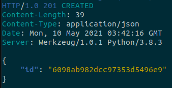
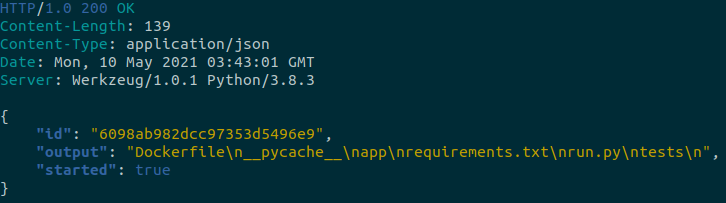

# Commands

This project allows to store the output of a command in a Mongo database throught execute it by a task background running in a RabbitMQ queue.

## Project structure

```
project/
    app/
        api/...
        models/...
    tests/
        api/...
        models/...
    Dockerfile
    requirements.txt
    run.py
.env
docker-compose.yml
Makefile

```

## How to run

To run this project need to have installed Docker and docker-compose. Then, add a file called as ```.env ```. This file contains env vars for rabbit and mongo and looks like that:

```
MONGO_USER=<user>
MONGO_PASS=<pass>

RABBIT_USER=<user>
RABBIT_PASS=<pass>
RABBIT_VHOST=<host>
```

1. Build and run project
    - ``` docker-compose up --build ```
2. Stops containers and removes containers
    - ``` docker-compose down ```
3. Run tests
    - ``` docker-compose run web pytest ```

Also, you can use makefile commands:

1. Build
    - ``` make build ```
2. Up
    - ``` make up ```
3. Run tests
    - ``` make unit ```

## Usage

To use this project, you can execute http calls using [httpie](https://httpie.io/) client.

1. Store command.
    - ```http POST http://0.0.0.0:5001/task/ cmd="ls" ```
    

2. Get command.
    - ``` http http://0.0.0.0:5001/task/6098ab982dcc97353d5496e9 ```
    
